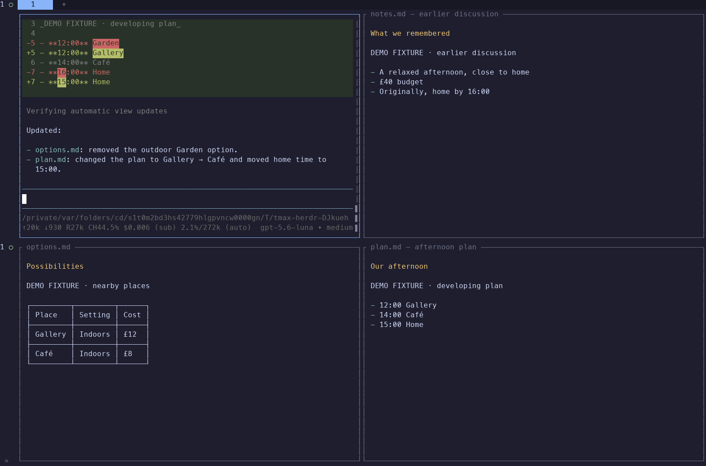

# One conversation, living views

Bring something useful into view, keep talking, and gather back when you want
your attention in one place. The surrounding views can stay useful for seconds,
a whole project, or many conversations.

[Watch the 47-second demo](assets/views-demo.mp4)



The recording uses the real Pi interface and Herdr client, with a small, explicitly
labeled planning fixture. It starts with Pi ready, includes model waits and short
reading pauses, and is not sped up. Terminal bytes were recorded through a PTY and
rasterized for playback; this is **not native Terminal/Ghostty rendering verification**.
No character artwork, personality, or new UI theme was introduced.

## What works in this slice

- Show saved Markdown content or follow an existing file beside the conversation.
  Adding views spreads 1 → 2 → 4 while preserving focus and existing terminals.
- File changes appear automatically, including atomic replacement. A missing
  source shows a visible error and recovers when it returns. Pi supplies Markdown,
  themes, scrolling, and text selection; a view starts at the top of its document.
- Gather into the conversation without closing views or stopping their processes.
  Reveal the same layout again. Pi commands `/gather` and `/spread` skip model latency.
- Close a display and reopen its retained content later, or explicitly discard it.
  Discard never deletes an external source. Updating a view with supplied content
  writes its own saved document, leaving the original external file intact.
- Reuse saved view IDs after extension reload or Pi restart. A crashed viewer can
  reopen in a fresh pane; a pane repurposed for other work is protected from dismissal.

The Go launcher embeds two small TypeScript modules: view tools and a standalone
file viewer. There is no new model loop or runtime dependency. Pi still owns agent
execution and conversations; Herdr owns pane processes. The existing split-and-return
tools remain available when actual parallel work is useful.

Saved view records and owned documents live in tmax's per-project application data
directory, outside the source tree and extension cache. An external file stays an
external file: deleting it makes its view unavailable. Gathering keeps displays
running; closing a display stops that renderer while retaining its document.
After a server/computer restart, reopening starts a new renderer. It does not restart
data producers, restore unsaved process state, or run an old command automatically.

## Evidence and remaining friction

Local lifecycle samples on macOS with Herdr 0.9.0 and Pi 0.85.1:

| Boundary | Observed samples |
| --- | --- |
| Request → first rendered view, including verification | 0.45–0.59 s |
| Source-file replacement → observed display update | 0.11–0.12 s |
| Gather invocation → verified zoom | 8–12 ms |

These are individual development-machine samples, not latency guarantees. They
exclude model time. In one live run, two simultaneous view calls completed locally
in 0.90 seconds including queueing; the natural request took 9.88 seconds to finish.
The first implementation rejected one simultaneous call and needed a model retry.
Serializing mutations locally removed that reproduced failure.

The 24 headless regressions cover both terminal environment variants, retained
terminal IDs, active project directory, source changes, scrolling, parent restart,
viewer crashes, repurposed panes, launch acknowledgement timeout, canceled queued
requests, and the Go binary's embedded renderer. Environment coverage is distinct
from native rendering. The existing direct workspace benchmark remains separate.

**Shared-context semantics are not reliable yet.** Several natural conversations
revised the remembered discussion to match a new decision instead of preserving
the historical record. This happened with both low and medium reasoning. General
source-preservation guidance did not eliminate it. The final recorded TUI run
preserved history and updated both current views, but one success is not a fix.
No filename triggers, prompt-phrase dispatch, or benchmark-specific production
rules were added. The next iteration should make source/history handling trustworthy
without asking the user to manage data routing.

This slice has one conversational anchor with document views. It does not establish
continuous conversation from every pane, automatic context sharing between model
instances, autonomous refresh of web data, or superiority over Claude Code/Agent SDK
with tmux. View mutation ordering is local to each Pi extension instance, not a
cross-process transaction system.

## Reproduce and inspect

```sh
go build -o bin/tmax .
go test ./...
go vet ./...
TMAX_BENCH=1 node --test tests/*.test.mjs
TMAX_REPEATS=2 node benchmarks/local.mjs /tmp/tmax-local.json
TMAX_LIVE=1 node benchmarks/views-live.mjs /tmp/tmax-views.json
TMAX_LIVE=1 TMAX_TEST_THINKING=medium node benchmarks/views-demo.mjs /tmp/tmax-demo
```

The last two commands use the signed-in model account. The PTY recorder uses `uv`
and Python's standard library only. Default diagnostic model: Luna; runtime model
and reasoning preferences are unchanged. The recording's native terminal data and
stage timing are in [the demo evidence](../benchmarks/results/views-demo).

Live trials: [initial retry](../benchmarks/results/views-live-2.json),
[history failure found in audit](../benchmarks/results/views-live-3.json),
[low reasoning](../benchmarks/results/views-live-4.json),
[medium reasoning](../benchmarks/results/views-live-5.json).
The first [harness error](../benchmarks/results/views-live-1.json) is retained:
an assertion returned no truthy value, so the observer timed out despite a visible
view. The next checker revision also sampled too early; it now rechecks turn-end
state. These errors are not counted as product improvements.

Mechanical evidence: [full regressions](../benchmarks/results/views-regressions.txt),
[view lifecycle](../benchmarks/results/views-lifecycle.txt),
[embedded renderer](../benchmarks/results/views-packaging.txt), and
[64 direct workspace observations](../benchmarks/results/views-local.json).
